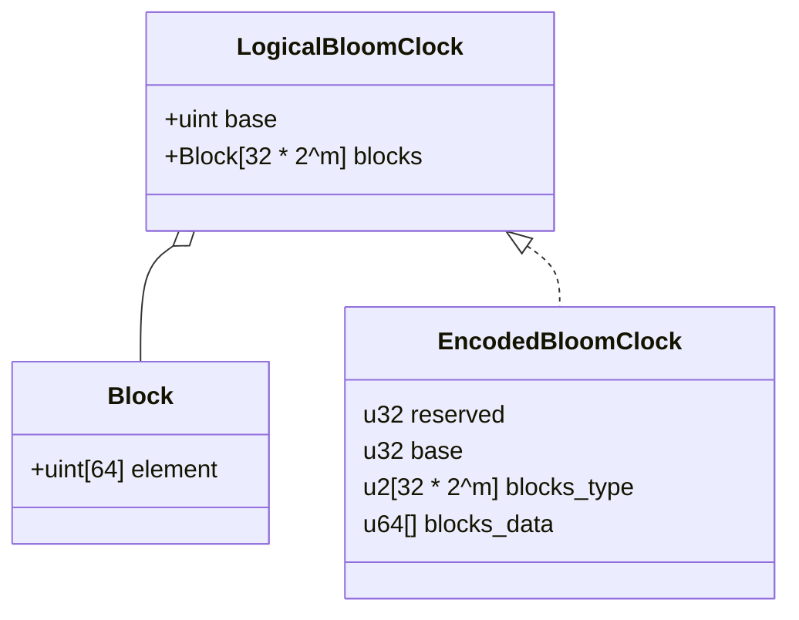
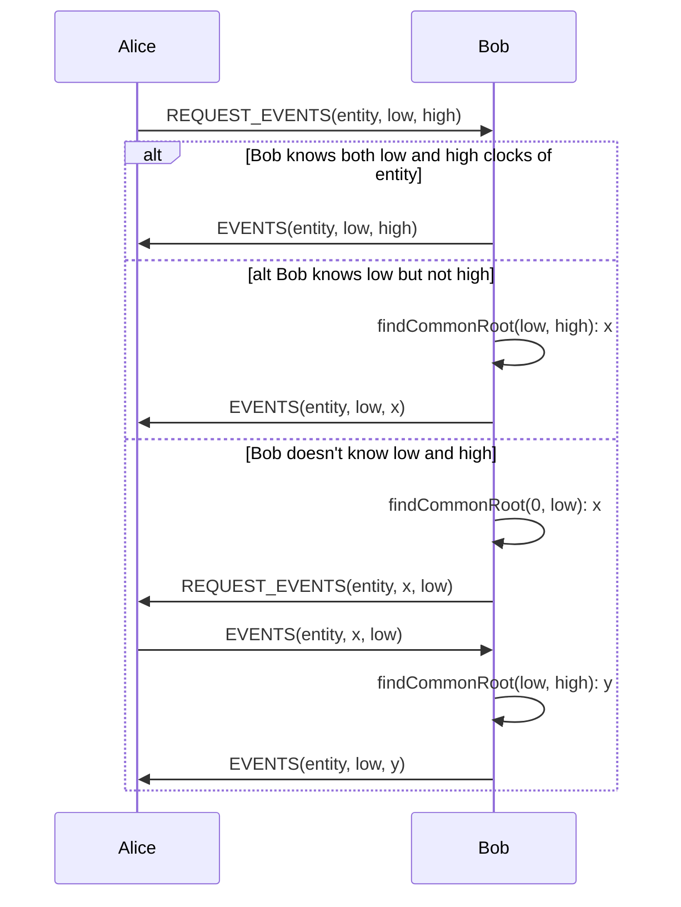
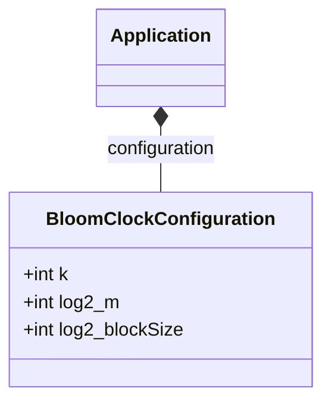

# Synchronisation protocol

This section describes in detail a synchronisation protocol using Bloom Clock
with abstraction to the actual application.  It can be derived into a 
concrete library that can be used for various applications independently of the
core SSB protocol.

## Bloom Clock encoding

Logically, a Bloom Clock is just an array of positive integers.  A first 
consideration when considering the use cases of the protocol, with the 
assumption of the Random Oracle Function that will generate k indices with 
uniform probably, it is easy to demonstrate that the elements of the array will
be very near to each others and that it depends only on the size of the 
bloom clocks and the parameter k.



Conceptually, the BloomClock has a `base` which is equal to the minimum of 
elements of the clock. The elements are encoded into blocks of 64 
elements with only the reminder after substracting the `base`.

To make it efficient for the comparison algorithm, we propose the following 
that should cover all use case identified so far with some flexibility.

- the `base` is encoded as u32 so that a clock can represent roughly a maximum 
  of (4.294.967.295 / k) consecutive updates on a given entity.
- the elements are encoded in `32 * 2^m` blocks.  Each block can be 
  encoded in 1 of 4 formats.  The array of 2 bits integers `blocks_type` 
  specifies type of each block. The 4 formats are defined by the application 
  configuration. The number of blocks is defined by the parameter `m` by 
  configuration of the application.
- The `blocks_data` array contains the encoded blocks as per `blocks_type`.  

`m` is the configuration parameter that determines the number of elements 
of the underlying counting bloom filter.  With m = 0,1,2,3,4, ..., the total 
number of elements of the clock is 32 * 2^m^ * 64 = 2048,4096,8192,
16384,32768,... . 

We define so far 2 options for the encoding format:

- FORMAT_1248 : The elements in the blocks are encoded either with 1, 2, 4 or 8 
  bits per element. The encoder select the minimum size given the maximum 
  value in the 
  block.  So with blocks of 64 elements, a block will occupy 8, 16, 32 or 64 
  bytes. 
- FORMAT_0148 : With large bloom clock, which desirable in most use cases, 
  most of the blocks will contain only zeros, less frequently some 1 and even 
  less frequently larger values. With this format, blocks full of zeros are 
  skipped and other blocks are encoded with either with 1, 4 or 8 bits per 
  elements. This is expected to permit the usage of large bloom clocks while 
  limiting the size of the data to be transmitted, stored and processed.

!!! question

    We start the encoded buffer with a u32 `reserved` for future use.  This 
    is essentially to pad the data at 64 bit.  It may be interesting to 
    encode here the block format, the parameter `m` and the parameter `k`.
    While clocks with different `m`and `k` are incompatible, different 
    format of block may offer higher compression ratio.  Now, the question, 
    does it worth the added complexity ?

!!! note
    
    The first 2 bytes of the `reserved` field may be used to specify a new 
    type (version) and format (bloomclock-v1) by updating the [@ssb-bfe-spec] 

## Base functions

``` javascript
/**
 * Compare 2 EncodedBloomClock.
 *
 * @param x the first clock.
 * @param y the second clock.
 * @returns This method returns the value zero if (x==y), if (x precedes y) 
            then it returns a value less than zero, if (x precedes y) then it 
            returns a value greater than zero else it returns none.
 */
function compare(x: EncodedBloomClock, y: EncodedBloomClock) : Some<int32> {
    // todo
}

/**
 * Increment the elements.
 *
 * @param x the c.
 * @param rom the indices provided by the Random Oracle Function of the application.
 * @returns This method returns the new EncodedBloomClock or fails if increment 
 * cannot fit in the format (base > uint32.MAX or some element > 255).
 */
function tick(x: EncodedBloomClock, rom: uint32[k]) : Result<EncodedBloomClock> {
    // todo
}

```

Several interesting properties of this encoding that can accelerate 
computations:

All elements of the clock are in the range `[base..(base+255)]`

With blocks:

  - For blocks 0, all elements are equal to `base`
  - For blocks 1, all elements are in the range `[base..(base+1)]`
  - For blocks 2, all elements are in the range `[base..(base+3)]` and at 
    least 1 element >= `base+2`
  - For blocks 4, all elements are in the range `[base..(base+15)]` and at
    least 1 element >= `base+4`
  - For blocks 8, all elements are in the range `[base..(base+255)]` and at
    least 1 element >= `base+16` and 1 element per byte
  
The chosen alignments permit to use efficients SIMD instructions for encoding/decoding and comparisons.
The alignments and block size are 'cache line' friendly.

For comparison of clocks,

  - If the difference between bases > 255, we can conclude immediately
  - Block of type 4 contains 1 element per byte.
  - If the bases are the same, pairwise per block,
    * If both blocks are type 0, they are equal
    * If only one block is type 0, the other is larger
    * If both blocks are type 1, they can be compared using simple bitwise 
      ops without decoding.
  - If the difference between bases is 1, ...

## The communication protocol

The purpose of this protocol is to allow 2 peers to synchronise their 
knowledge about updates performed on a given entity in only 4 rounds.






Application

:   The Application specifies the Bloom Clock configuration to use

BloomClockConfiguration

:   The configuration specifies the number of indices generated by the 
    Random Oracle Function, the log~2~ of the number of block per clock and
    


